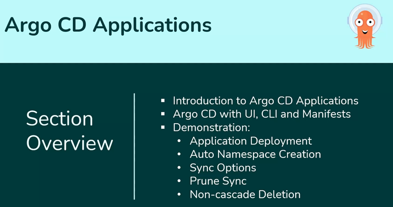

An application in Argo CD is a custom resource that represents a deployed instance of a Kubernetes resource in a cluster.

The key components of an Argo CD application are:

1. Source: The source is where your Kubernetes configuration files are stored. This is typically a Git repository that contains the files defining how your application should be deployed. These files describe the desired state of your application, such as the number of replicas, service configurations, and more. Instead of plain YAML manifests as a source, we can also use Helm charts, Kustomize, or Jsonnet sources.

2. Destination: The destination is the cluster and namespace where the application will be deployed. It defines where the resources described in the source should be applied.

3. Sync Process: Argo CD continuously monitors the source and ensures that the resource state in the destination matches the desired state. If changes are detected in the source, Argo CD can automatically or manually synchronize these changes to the cluster.

# Argo CD - How You Can Create and Manage Applications

There are three primary ways to create and manage applications in Argo CD:

- through the user interface (UI)
- through the command-line interface (CLI)
- by using manifests

Each method suits different user preferences and scenarios, making it easier to manage applications according to your workflow.

## 1. Using the UI

The Argo CD UI provides a graphical interface for users who prefer a visual approach to managing applications. This is the most commonly used method.

Through the console, you can easily create an application by filling in the required details, such as the repository URL, the path to the manifests, and the destination cluster and namespace. The UI also allows you to view and monitor the status of your applications, making it a convenient option for users who are new to Argo CD or prefer a more intuitive experience.

## 2. Using the CLI

For users who prefer command-line tools, Argo CD offers a way to create and manage applications using specific commands. You can provide the repository, specify the manifest path, and define the destination cluster and namespace.

The CLI is particularly useful for automation scripts and for users who are comfortable with terminal-based operations. It provides a fast, efficient, and reusable way to manage applications without navigating through a graphical interface.

## 3. Using Manifests

Applications can also be defined using YAML manifests. This approach involves creating a YAML file that includes all the necessary details about the application, such as the source repository, the paths to the manifests, the destination cluster and namespace, and synchronization policies.

Once the manifest is ready, it can be applied to Argo CD to create the application. This method is ideal for those who prefer to manage their configurations as code, allowing for version control and easier collaboration.

Each of these methods—UI, CLI, and manifests—provides a flexible way to interact with Argo CD, making it more accessible to a wide range of users and suitable for various deployment scenarios.

So that is it for now. Now let us move to the demos to see them in action.
