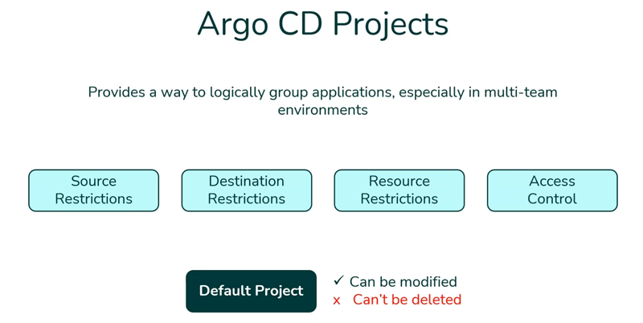

# Argo CD projects

Argo CD projects provide a way to logically group applications, especially in multi-team environments. Projects help manage deployments by offering several key features.

Let us go through them:

1. Source restrictions: We can limit the Git repositories from which applications can be deployed.
2. Destination restrictions: These control which clusters and namespaces applications can be deployed to.
3. Resource restrictions: These define which Kubernetes resources can be managed. For example, certain CRDs can be deployed.
4. Access control: This sets roles and permissions for teams using OIDC groups or JWT tokens.

By default, all applications belong to the default project, which is permissive and allows deployment from any source repository to any cluster. You can modify this default project for all resource types, but it cannot be deleted.

In the upcoming demos, we will demonstrate how to create and configure custom projects with different levels of access and restrictions.