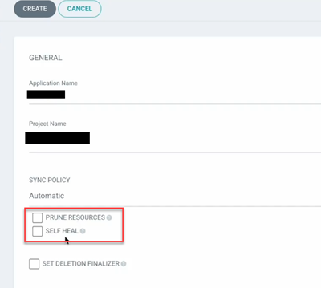
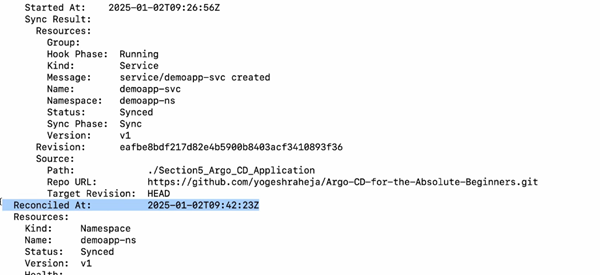
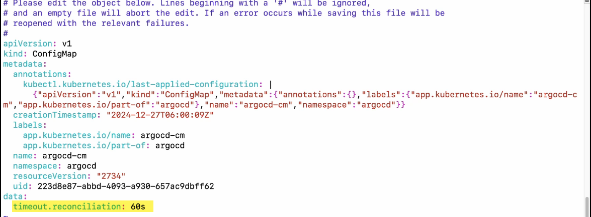
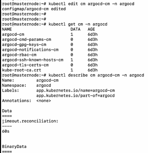
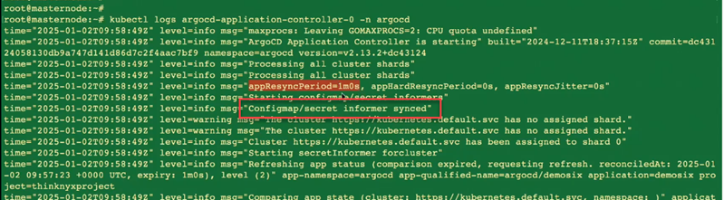

# Automatic Sync Option

In this section, we will explore the automatic sync policy in Argo CD, covering key features such as application deployment, resource pruning, self-healing, and configuring sync reconciliation time.

## manual sync policy
In the manual sync policy, we were manually pressing the Sync button to verify and synchronize the live state with the desired state. However, this process can be automated. To automate this process, you need to set the sync policy to automatic.

##  automatic sync policy
In the automatic sync policy, Argo CD compares the state in your Git repository with the current state in your cluster every 180 seconds. It will check the state in your Git repository, reconcile it, and sync it in your environment automatically.

This process operates in a loop called the reconciliation loop. The default duration of this reconciliation loop is 180 seconds. So whenever the sync policy is set to automatic, the comparison will happen every 180 seconds and the desired state will become equal to the live state.

### options

In this process, there are a few additional options. For example, prune resources is an option you can enable. Although we have already seen a similar case in the manual sync policy, if you want to replicate that in the automatic sync policy, you must enable the prune resource option.

Let us assume you have a Git repository with a namespace, deployment, and service defined. You have used the automatic sync option and deployed it in your cluster.

Now, let us say that after 180 seconds or even before that, someone manually deletes the deployment. What happens to the state? Nothing happens, except that you will still have the namespace, deployment, and service. But they will show as out of sync.

If you want the deleted deployment to be removed from the cluster when it is deleted from your Git, you need to enable the prune resource option in the automatic sync policy.

There is another very important option called self-healing that can be enabled with automatic sync. Let us understand that.

Imagine you have a Git repository with a namespace, deployment, and service defined. You use the automatic sync option and deploy it to your cluster. Let us say that the namespace, deployment, and service are deployed correctly.

Now you have three files. However, let us assume someone manually deletes the deployment using a `kubectl` command. What happens now? Your application will experience downtime.

In this case, what you want is for Argo CD to automatically check your Git repository. When anything is manually deleted in the cluster, if it finds that the deleted resource still exists in Git, it should automatically recreate it.

To achieve this, you need to enable the self-healing option. This option ensures that if anything is manually deleted from the cluster, it will be automatically recreated, preventing downtime in your environment.

Therefore, in the automatic sync policy, you will have additional options such as prune resources and self-healing.

## Self-healing option
 If anything is deleted from your cluster,it will take 180 seconds for the auto sync to be triggered to recreateyour resource ensuring that your life state becomes equal to a desired state.However,during this time, you will experience some downtimeif mistakenly someone deletes something from your clusterand your desired state has the Manifest or state defined there,you would want that to be rectified immediately, right? In such cases, we use the self heal option.

## change the reconciliation time
What if we want to change the reconciliation time from 180 seconds to, let us say, 360 seconds, which is equivalent to six minutes? How do we do that?

You can achieve this by modifying the ConfigMaps created during the deployment of Argo CD. The default reconciliation time can be updated or configured in the ConfigMaps of Argo CD components, and this is something we will see in the demo.

We can see the reconciliation time as follows:
    $ kubectl get app -A
    # this will show something like:
    #   Namespace       Name        Sync Status     Health Status
    #   argocd          demosix     Synced          Healthy

    # To see the reconciliation time:
    $ kubectl describe app demosix -n argocd

    

    # If we can check the reconciliation time every 30 seconds we can do something like:
    $ while true; do kubectl describe app demosix -n argocd | grep -i Reconciled; sleep 30; done

To change it:
See documentation in https://argo-cd.readthedocs.io/en/stable/operator-manual/high_availability/#argocd-repo-server

or:

Declarative setup https://argo-cd.readthedocs.io/en/stable/operator-manual/declarative-setup/ and then `argocd-cm.yaml` : https://argo-cd.readthedocs.io/en/stable/operator-manual/argocd-cm-yaml/

    $ kubectl edit cm argocd-cm -n argocd

After the changes are made, you need to restart the server deployment:
    $ kubectl get deployment -n argocd
    $ kubectl rollout restart deployment argocd-repo-server -n argocd

Additionally you hae to restart the statefulset
    $ kubectl get all -n argocd
    $ kubectl describe pod/argocd-application-controller-0 -n argocd |more #This will show that it is using the configmap from the stateful set.
    $ kubectl rollout restart sts argocd-application-controller -n argocd

You can validate with the logs and checking for `Configmap/secret informer synced`:
    $ kubectl logs argocd-application-controller-0 -n argocd

    
    