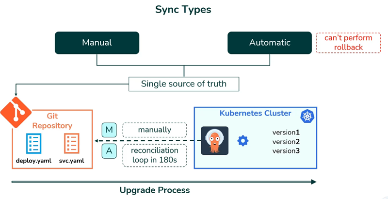
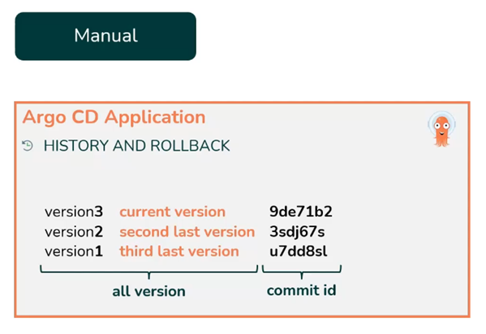
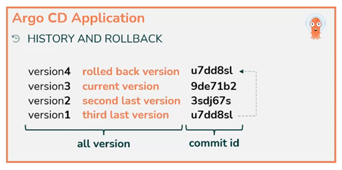
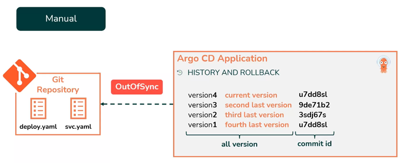

# Rollbacks

To perform a rollback, you must switch to the `manual sync type`.

Once you switch to the manual sync, you can go to your applicationand find the upgrades and rollback tab. 

In this tab, you will see the initial version followed by the versions you upgraded to.You will also see the corresponding comment ids. For example, let's say the current version is version three,but you want to roll back to version one.

When you do this,let's call it a revision four will be createdand the rollback will reward the application to previous state.

After performing this roll back,you will see this new version in your Argo CD console.However, since this version is not in git anymore,you will see an out of sync status.

to resolve this you'll need to make the changes on the code to match the current state of the server and sync again.
