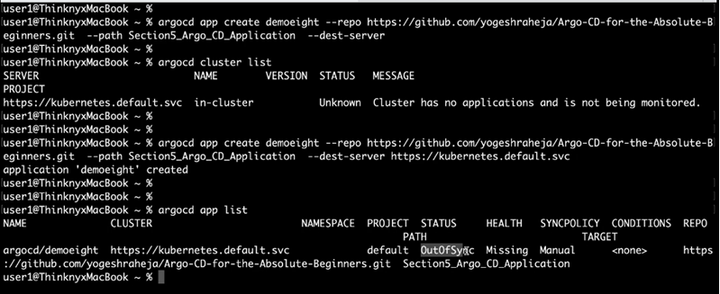
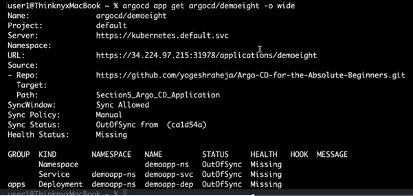
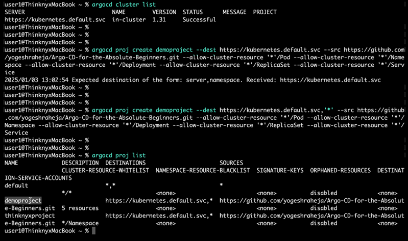

# ArgoCd CLI

Reference: https://argo-cd.readthedocs.io/en/stable/user-guide/commands/argocd/

## Applications

To show the list of deployed applications
    $ argocd app list

To get help
    $ argocd app --help

To get help from create
    $ argocd app create --help

If you want to get the details of application,you can use the command
    $ argocd app get {application_name}

    

To sync the application
    $ argocd app sync {application_name}
    # after synking you'll see `Successfuly synced`

If you want to compare the live state and the desired state:
    $ argocd app diff {application_name}

To delete the application
    $ argocd app delete {application_name}

## Clusters

Get the list of clusters
    $ argocd cluster list

## Projects

Get the list of projects
    $ argocd proj list

To get help on a project
    $ argocd proj --help

to get help on project create
    $ argocd proj create --help

to create a project
    $ argocd proj create {project_name} --dest {dest} --src {src} --allow-cluster-resource {cluster_resource}

